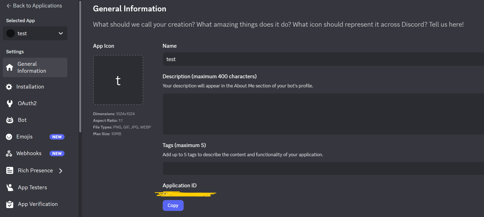
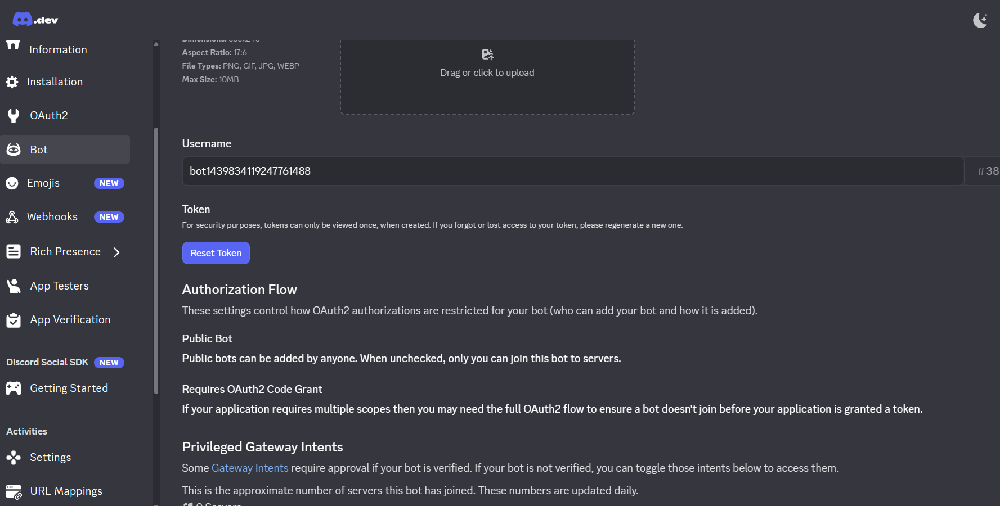
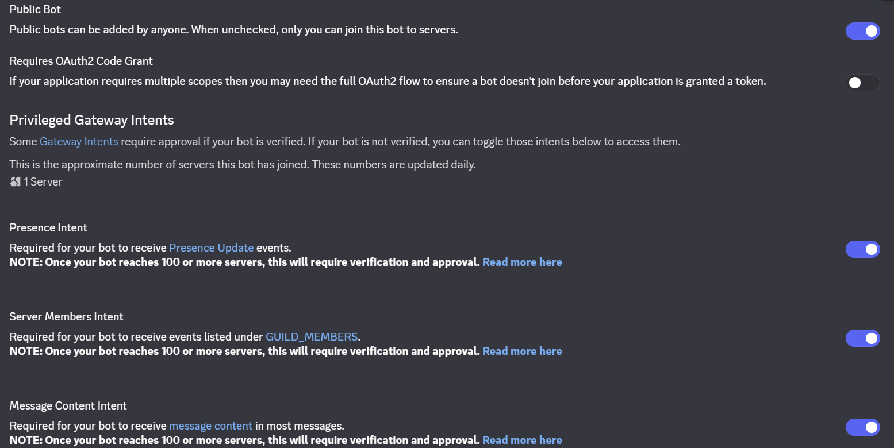
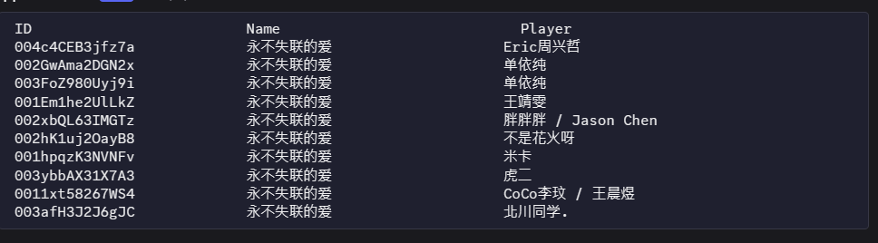

# Discord QQ 音乐机器人

这是一个 Discord QQ 音乐机器人，它可以在 Discord 语音聊天频道中播放 QQ 音乐。

## 功能特性

- **语音频道播放**: 在 Discord 语音频道中播放 QQ 音乐。
- **Docker Compose 部署**: 完全自托管，通过 `docker-compose.yml` 文件一键部署。
- **命令控制**: 通过 Discord 命令与机器人交互。

### 支持的命令

-   `/cancel`: 立即取消正在播放的歌曲，同时清空播放队列。
-   `/search <音乐名>`: 搜索 QQ 音乐，并显示搜索结果列表。
-   `/play <ID>`: 将指定 ID 的音乐添加到播放队列。

## 部署

本项目支持使用 Docker Compose 进行自托管部署。

### 1. 获取凭证

在部署之前，您需要获取以下凭证：

-   [**QQ 音乐网页版 Cookie**](https://github.com/feeluown/feeluown-qqmusic/issues/6): 用于机器人访问 QQ 音乐的 API

    1. 在[qq音乐网页版](https://y.qq.com/) 登录账号
    2. 右键```Inspect```进入控制台，切换到```Network```栏目，任意寻找一个请求
    3. 获取其全部Cookie数据，如下图所示

       


-   **Discord Bot**: 您的 Discord 机器人的身份验证令牌。

    1. 访问 [Discord Developer Portal](https://discord.com/developers/applications)。
    2. 点击 ```New Application```，创建新应用或者使用已有应用。
    3. 创建成功后自动进入主页，在主页中即可获取```Application id```

        

    4. 在应用页面，导航到 "Bot" 选项卡。
    5. 点击 "Add Bot" 创建一个机器人用户。
    6. 在机器人页面，您可以找到 "TOKEN" 部分。点击 ```Reset Token``` 获取新的 ```DISCORD_TOKEN```

        

    7. 配置机器人权限

        


### 2. 配置环境变量

修改```.env.example```的模板配置文件为```.env```，并填入您的凭证：

```
# Discord Bot Token
DISCORD_TOKEN=YOUR_DISCORD_BOT_TOKEN

# Discord Bot Application ID
DISCORD_BOT_ID=YOUR_DISCORD_BOT_APPLICATION_ID

# QQmusic Cookie
COOKIE=YOUR_QQMUSIC_COOKIE

# 日志级别 (可选，默认为 info)
RUST_LOG=discord_qqmusic_bot=info,serenity=error,tracing=error,songbird=error
```

请将 `YOUR_DISCORD_BOT_TOKEN`、`YOUR_DISCORD_BOT_APPLICATION_ID` 和 `YOUR_QQMUSIC_COOKIE` 替换为实际的值。

### 3. 准备 Docker 网络 (Optional)

如果您已经有使用中的docker内部网络，可以直接替换```docker-compose.yml```中的network配置，如果没有，您可以使用这个不需要Docker网络版本的```docker-compose.yml```配置文件
    

    services:

      qqmusic-bot:

        image: ghcr.io/0xcathiefish/discord-qqmusic-bot:latest

        container_name: qqmusic-bot

        restart: always

        env_file:
          - .env


### 4. 运行机器人

最终目录情况如下

```
.
├── .env
└── docker-compose.yml
```

在项目根目录，执行以下命令启动机器人：

```bash
$ docker compose up -d
```

看到这样的输出日志即是启动成功

```
$ docker logs -f qqmusic-bot
[2025-11-12T07:46:34Z INFO  discord_qqmusic_bot::qqmusic] QQmusic: Success to initialize the client
[2025-11-12T07:46:38Z INFO  discord_qqmusic_bot::bot] Bot: Success to initialize the client
[2025-11-12T07:46:42Z INFO  discord_qqmusic_bot::bot] qq-music-bot Connected
```


## 如何使用

1.  **邀请机器人**: 将您的 Discord 机器人邀请到您的 Discord 服务器。确保机器人具有加入语音频道、发送消息和读取消息的权限
2.  **加入语音频道**: 在 Discord 中，您需要先加入一个语音频道
3.  **搜索音乐获取其ID**: 在聊天频道中，使用命令```@YOUR_BOT /search 永不失联的爱```

    得到返回ID的Table

    
4. **添加音乐到播放队列**： 在聊天频道中，使用命令```@YOUR_BOT /play ID```
5. **取消播放并清空播放队列**: 在聊天频道中，使用命令```@YOUR_BOT /cancel```


## 许可证

本项目采用 Apache 2.0 许可证。详情请参阅 [LICENSE](LICENSE) 文件。


Auto generated by Gemini